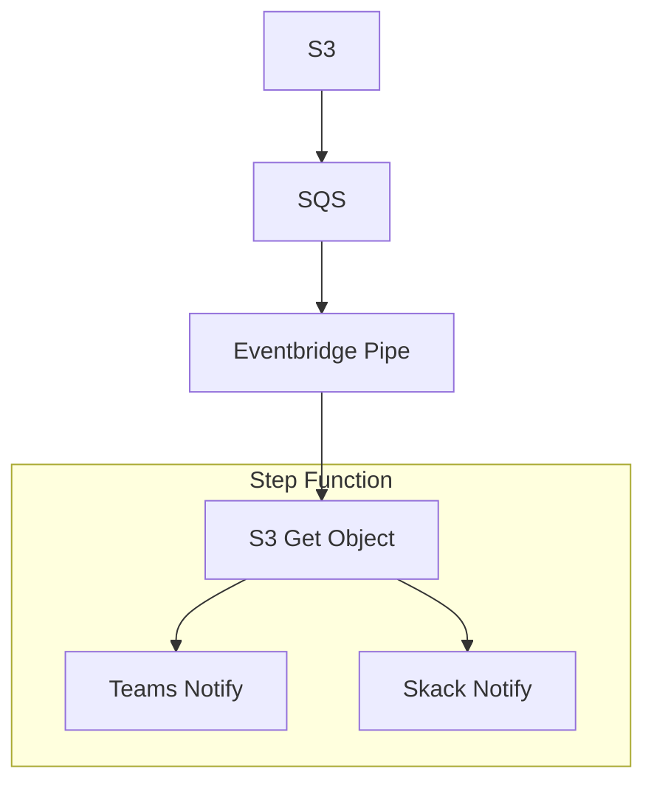

S3にJsonデータを入れるだけで、そのJsonデータ内容に応じてSlackやTeamsに通知したい！！

みたいなケースに役立つ記事になると思います。

## 全体構成図



詳細にかくと以下のようなフローとなります。

- S3イベントをフックする
- SQSに渡す
- SQSからEventBridgeに流す
- EventBridgeからStepFunctionを起動する
- S3イベント情報を抽出する
- S3からオブジェクトを取得しJsonで展開する
- エラーを判定する
- TeamsにHookする
- SlackにHookする

これらの流れをTerraformとStepFunctionのステートマシン定義を利用し、TeamsとSlackに通知していこうと思います。

## AWS S3 to SQS

最終的にはS3をトリガーにして、StepFunctionを起動しますが、先ずはSQSにシグナルを送信します。

これはStepFunction失敗時に再試行する時や、そもそもStepFunctionの実行タイミングを制御したいときなどにSQSを利用する事が出来る為です。

```tf

# S3からSQSに通知を送る
resource "aws_s3_bucket_notification" "bucket_notification" {
  bucket = "bucket_name"

  queue {
    queue_arn = aws_sqs_queue.source_queue.arn
    events    = ["s3:ObjectCreated:*"]
  }
}

# S3から受け取るSQS
resource "aws_sqs_queue" "source_queue" {
  name = "aws_sqs_queue_sample"

  delay_seconds              = 0
  max_message_size           = 262144
  message_retention_seconds  = null
  visibility_timeout_seconds = null
  receive_wait_time_seconds  = null
}

# SQSキューのポリシー設定
# Bucket からのシグナルを受信可能にするポリシー
resource "aws_sqs_queue_policy" "source_queue_policy" {
  queue_url = aws_sqs_queue.source_queue.id

  policy = jsonencode({
    Version = "2012-10-17"
    Statement = [
      {
        Effect = "Allow"
        Principal = {
          Service = "s3.amazonaws.com"
        }
        Action   = "sqs:SendMessage",
        Resource = "${aws_sqs_queue.source_queue.arn}"
        Condition = {
          ArnLike = {
            "aws:SourceArn" = "arn:aws:s3:*:*:bucket_name"
          }
        }
      }
    ]
  })
}

```

`aws_s3_bucket_notification` を利用する事で、S3のイベントをSQSやLambdaなどにイベントをフックすることが出来ます。

## SQS to EventBridge Pipe to StepFunction

SQSからはEventBridge Pipe機能を経由してStepFunctionを起動します。

SQSから直接StepFunctionへのイベントをフック出来ない為、EventBridgeを経由することになります。

```tf
# SQS to StepFunction のEventBridgePipe
resource "aws_pipes_pipe" "step_function_trigger" {
  name   = "eventbridge_sample"
  source = aws_sqs_queue.source_queue.arn

  source_parameters {
    sqs_queue_parameters {
      batch_size                         = 1
      maximum_batching_window_in_seconds = 0
    }
  }

  # StepFunctionは後述します
  target = aws_sfn_state_machine.processing_workflow.arn 

  target_parameters {
    step_function_state_machine_parameters {
      invocation_type = "FIRE_AND_FORGET"
    }
  }

  role_arn = aws_iam_role.eventbridge_step_function_role.arn
}
```

IAM Role、ポリシーを適切に設定する必要があるため、以下のようなポリシーを作成します。

```tf
# EventBridgePipe から Step Function を起動するための IAM ロール
resource "aws_iam_role" "eventbridge_step_function_role" {
  name = "eventbridge_sample_role"

  assume_role_policy = jsonencode({
    Version = "2012-10-17"
    Statement = [
      {
        Action = "sts:AssumeRole"
        Effect = "Allow"
        Principal = {
          Service = [
            "pipes.amazonaws.com"
          ]
        }
      }
    ]
  })
}

# EventBridgePipe から Step Function を起動するための IAM ポリシー
resource "aws_iam_role_policy" "eventbridge_step_function_policy" {
  name ="eventbridge_sample_role_policy"
  role = aws_iam_role.eventbridge_step_function_role.id

  policy = jsonencode({
    Version = "2012-10-17"
    Statement = [
      {
        Effect = "Allow"
        Action = [
          "states:StartExecution"
        ]
        Resource = aws_sfn_state_machine.processing_workflow.arn
      },
      {
        Effect = "Allow"
        Action = [
          "sqs:ReceiveMessage",
          "sqs:DeleteMessage",
          "sqs:GetQueueAttributes"
        ]
        Resource = aws_sqs_queue.source_queue.arn
      },
      {
        Effect = "Allow"
        Action = [
          "logs:CreateLogGroup",
          "logs:CreateLogStream",
          "logs:PutLogEvents"
        ]
        Resource = "arn:aws:logs:*:*:*"
      }
    ]
  })
}
```

StepFunctionの起動、SQSからのメッセージ受信、CloudWatchへのログ送信 の3種類を許可します。

## Stepfunction

最後に、StepFunctionを定義します。
definition は後で書きますので、一旦TerraformでStepFunctionを定義しておきます。

```tf
# Step Functionsの状態マシン定義
resource "aws_sfn_state_machine" "processing_workflow" {
  name       = "stepfunction_sample"
  role_arn   = aws_iam_role.step_functions_role.arn
  definition = "" # TODO: あとで書きます。
}

# Step Functionsの実行ロールの作成
resource "aws_iam_role" "step_functions_role" {
  name = var.sfn.role_name

  assume_role_policy = jsonencode({
    Version = "2012-10-17"
    Statement = [
      {
        Action = "sts:AssumeRole"
        Effect = "Allow"
        Principal = {
          Service = "states.amazonaws.com"
        }
      }
    ]
  })
}
```

## Stepfunction で外部APIを叩けるようにする

ここでTeamsとSlackへの送信をする為に、HTTP エンドポイントターゲットの接続 EventBridgeを作成します。

https://docs.aws.amazon.com/ja_jp/eventbridge/latest/userguide/eb-target-connection.html


ドキュメントに記載のとおり、APIの定義とEvent bus, pipeやConnectionの作成、SecretManagerからの認証情報の取得、それらをStepFunctionのHTTP taskから叩くと言った処理を書かなければなりません。

そこで、AWS公式が用意しているEvenBridgeのModuleを利用して手軽に上記設定を追加してみます。

https://registry.terraform.io/modules/terraform-aws-modules/eventbridge/aws/latest

```tf
#
# Teams Notification
#
locals {
  notify_teams_webhook_url    = "https://***"
  notify_teams_webhook_method = "POST"
  notify_teams_webhook_sig    = ""
}

module "eventbridge_with_api_teams_notification" {
  source = "terraform-aws-modules/eventbridge/aws"

  bus_name           = "teams-notify"
  create_connections = true

  connections = {
    teams_notify = {
      authorization_type = "API_KEY"
      auth_parameters = {
        api_key = {
          key   = "Content-Type"
          value = "application/json"
        }
      }
    }
  }
}

#
# Slack Notification
#
locals {
  notify_slack_webhook_url    = "https://***"
  notify_slack_webhook_method = "POST"
}

module "eventbridge_with_api_slack_notification" {
  source = "terraform-aws-modules/eventbridge/aws"

  bus_name           = "slack-notify"
  create_connections = true

  connections = {
    slack_notify = {
      authorization_type = "API_KEY"
      auth_parameters = {
        api_key = {
          key   = "Content-Type"
          value = "application/json"
        }
      }
    }
  }
}
```

これで、StepFunction HTTP task以外の部分が自動で作成されます。
簡単ですね。

この流れで、SlackとTeamsのWebhookURLを取得してみましょう。

- [Teams Webhook URL取得方法](https://support.microsoft.com/ja-jp/office/create-incoming-webhooks-with-workflows-for-microsoft-teams-8ae491c7-0394-4861-ba59-055e33f75498)
- [Slack Webhook URL取得方法](https://zenn.dev/murakami_koki/articles/7a059ca006b566)

上記のあたりの記事を参考に、URLを取得します。


## Stepfuntion - ステートマシン定義

ここが一番重要な部分ですが、SlackとTeamsに通知するためのステートマシンを定義します。

で、S3に入れるファイルを今回はエラー検知という事で、以下のようなJsonファイルがアップロードされてくる事とします。

```json
[
    {
        "code": "error_01",
        "message": "example errors"
    }
]
```

そして、以下のStepFunctionのステートマシン定義を記載します。

```json
{
    "StartAt": "S3DataTransfer",
    "States": {
        "S3DataTransfer": {
            "Type": "Pass",
            "Next": "S3FileImport",
            "Parameters": {
                "body.$": "States.StringToJson($)"
            },
            "InputPath": "$[0].body"
        },
        "S3FileImport": {
            "Type": "Map",
            "ItemProcessor": {
                "ProcessorConfig": {
                    "Mode": "DISTRIBUTED",
                    "ExecutionType": "STANDARD"
                },
                "StartAt": "Choice",
                "States": {
                    "Choice": {
                        "Type": "Choice",
                        "Choices": [
                            {
                                "Or": [
                                    {
                                        "Variable": "$.code",
                                        "StringEquals": "error_01"
                                    }
                                ],
                                "Next": "TeamsHook"
                            }
                        ],
                        "Default": "SlackHook"
                    },
                    "TeamsHook": {
                        "Type": "Task",
                        "Resource": "arn:aws:states:::http:invoke",
                        "Parameters": {
                            "Authentication": {
                                "ConnectionArn": "${TeamsWebhookConnectionArn}"
                            },
                            "ApiEndpoint": "${TeamsWebhookEndpoint}",
                            "RequestBody": {
                                "type": "message",
                                "attachments": [
                                    {
                                        "contentType": "application/vnd.microsoft.card.adaptive",
                                        "content": {
                                            "type": "AdaptiveCard",
                                            "body": [
                                                {
                                                    "type": "TextBlock",
                                                    "text": "StepFunctionでエラーが発生しました。 確認をお願いいたします。",
                                                    "weight": "bolder",
                                                    "size": "Large"
                                                }
                                            ]
                                        }
                                    }
                                ]
                            },
                            "Method": "${TeamsWebhookMethod}",
                            "QueryParameters": {
                                "api-version": "2016-06-01",
                                "sp": "/triggers/manual/run",
                                "sv": "1.0",
                                "sig": "${TeamsWebhookSig}"
                            }
                        },
                        "ResultPath": null,
                        "Next": "SlackHook"
                    },
                    "SlackHook": {
                        "Type": "Task",
                        "Resource": "arn:aws:states:::http:invoke",
                        "Parameters": {
                            "Authentication": {
                                "ConnectionArn": "${SlackWebhookConnectionArn}"
                            },
                            "ApiEndpoint": "${SlackWebhookEndpoint}",
                            "RequestBody": {
                                "blocks": [
                                    {
                                        "type": "section",
                                        "text": {
                                            "type": "mrkdwn",
                                            "text.$": "States.Format('*Code:*\n {} \n*Message:*\n {} \n ```\n{}\n```', $.code, $.message, States.JsonToString($))"
                                        }
                                    }
                                ]
                            },
                            "Method": "${SlackWebhookMethod}"
                        },
                        "End": true
                    }
                }
            },
            "ItemReader": {
                "Resource": "arn:aws:states:::s3:getObject",
                "ReaderConfig": {
                    "InputType": "JSON"
                },
                "Parameters": {
                    "Bucket.$": "$.body.Records[0].s3.bucket.name",
                    "Key.$": "$.body.Records[0].s3.object.key"
                }
            },
            "MaxConcurrency": 1000,
            "Label": "S3FileImport",
            "End": true,
            "ResultWriter": {
                "Resource": "arn:aws:states:::s3:putObject",
                "Parameters": {
                    "Bucket": "${ErrorLogExportBucketName}",
                    "Prefix": "sfn/error_log/"
                }
            }
        }
    }
}
```

この中で、`${ErrorLogExportBucketName}` などの変数が記入されていますが、これは以下のようにTerraform内で変数を展開することが出来ます。

```tf
definition = templatefile("${path.module}/statemachine/sample.asl.json", {
    ErrorLogExportBucketName = module.s3.arn // サンプル
})
```

このようにして、Terraformで定義した情報、特にARNなどの情報をステートマシン定義に展開する事が可能です。

では、ステートマシン定義上で行っている事を解説しようと思います。

### 1. データ整形

```json
"S3DataTransfer": {
    "Type": "Pass",
    "Next": "S3FileImport",
    "Parameters": {
        "body.$": "States.StringToJson($)"
    },
    "InputPath": "$[0].body"
},
```

これは、S3イベントデータのBody、つまりBucket名やアップロードされたファイルキー名などが入っているオブジェクトのみを取り出す作業をしています。
bodyの中には、Jsonエンコードされた文字列が入っており、StepFunction上でそのまま展開して使うのが難しい（出来るが、都度変換が必要）ので、
事前にJsonデコードして利用します。

### 2. S3 Get Object to JSON Map

```json
"S3FileImport": {
    "Type": "Map",
    "ItemProcessor": {
        "ProcessorConfig": {
            "Mode": "DISTRIBUTED",
            "ExecutionType": "STANDARD"
        },
        "StartAt": "Choice",
        "States": {} // Stateが入る
    },
    "ItemReader": {
        "Resource": "arn:aws:states:::s3:getObject",
        "ReaderConfig": {
            "InputType": "JSON"
        },
        "Parameters": {
            "Bucket.$": "$.body.Records[0].s3.bucket.name",
            "Key.$": "$.body.Records[0].s3.object.key"
        }
    },
    "MaxConcurrency": 1000,
    "Label": "S3FileImport",
    "End": true
}
```

このStateは非常に便利なStateとなっており、S3から取得したJsonデータを展開してMapとしてループ処理を回すことが出来ます。

要は、コルーチンで回せると言うことですね。

`"ItemReader"` にBucket名とKey名を展開するように指定すれば、S3のデータを持ってくる事が出来ます。

`"States": {} // Stateが入る` StatesにMap処理を行う中身のステートマシン定義を更に記入します。

### 2-1. Choice - エラーコードでTeamsに通知するかどうかを分岐する処理

```json
"Choice": {
    "Type": "Choice",
    "Choices": [
        {
            "Or": [
                {
                    "Variable": "$.code",
                    "StringEquals": "error_01"
                }
            ],
            "Next": "TeamsHook"
        }
    ],
    "Default": "SlackHook"
},
```

Mapの中身に移ります。
このMapではエラーの配列内部のレコード毎に実行されます。

ここの例ではTeamsにWebhookをするかどうかをエラーコードから判別して分岐しています。
DefaultはSlackにしているので、該当しないエラーコードであればSlackHookに流れます。

### 2-2. TeamsHook

```json
"TeamsHook": {
    "Type": "Task",
    "Resource": "arn:aws:states:::http:invoke",
    "Parameters": {
        "Authentication": {
            "ConnectionArn": "${TeamsWebhookConnectionArn}"
        },
        "ApiEndpoint": "${TeamsWebhookEndpoint}",
        "RequestBody": {
            "type": "message",
            "attachments": [
                {
                    "contentType": "application/vnd.microsoft.card.adaptive",
                    "content": {
                        "type": "AdaptiveCard",
                        "body": [
                            {
                                "type": "TextBlock",
                                "text": "StepFunctionでエラーが発生しました。 確認をお願いいたします。",
                                "weight": "bolder",
                                "size": "Large"
                            }
                        ]
                    }
                }
            ]
        },
        "Method": "${TeamsWebhookMethod}",
        "QueryParameters": {
            "api-version": "2016-06-01",
            "sp": "/triggers/manual/run",
            "sv": "1.0",
            "sig": "${TeamsWebhookSig}"
        }
    },
    "ResultPath": null,
    "Next": "SlackHook"
},
```

いよいよ本題です。

`Parameters.Authentication.ConnectionArn` には、先ほどTerraformで作成したEventBridgeのConnectionArnを記入します。

Connectionで定義した同じAPIEndpointを `"ApiEndpoint": "${TeamsWebhookEndpoint}",` に入れ、 `RequestBody` にTeams側に投げるデータを作成します。
TeamsのワークフローではQueryParamsによる認証も入っているため、署名情報を `QueryParameters` に定義しています。

`"Next": "SlackHook"` と書いてあるように、Teamsには限定的な情報を、Slackはすべての通知を流すように設定しています。

### 2-3. SlackHook

```json
"SlackHook": {
    "Type": "Task",
    "Resource": "arn:aws:states:::http:invoke",
    "Parameters": {
        "Authentication": {
            "ConnectionArn": "${SlackWebhookConnectionArn}"
        },
        "ApiEndpoint": "${SlackWebhookEndpoint}",
        "RequestBody": {
            "blocks": [
                {
                    "type": "section",
                    "text": {
                        "type": "mrkdwn",
                        "text.$": "States.Format('*Code:*\n {} \n*Message:*\n {} \n ```\n{}\n```', $.code, $.message, States.JsonToString($))"
                    }
                }
            ]
        },
        "Method": "${SlackWebhookMethod}"
    },
    "End": true
}
```

SlackもTeamsと同様に、ConnectionArnとApiEndpointを入力し、SlackWebhookに合ったRequestBodyを記載します。
非常に簡単ですね。

ちなみに、Method はどちらも `POST` です。

## ステートマシン定義をTerraformで読み取る

少し先だししてしまいましたが、以下のようにして、StepFunctionのステートマシン定義に記載した変数に情報を割り当てます。


```tf
resource "aws_sfn_state_machine" "processing_workflow" {
  name       = "stepfunction_sample"
  role_arn   = aws_iam_role.step_functions_role.arn
  definition = templatefile("${path.module}/statemachine/test.asl.json", {
    TeamsWebhookConnectionArn = module.eventbridge_with_api_teams_notification.eventbridge_connections["teams_notify"].arn
    TeamsWebhookEndpoint      = local.notify_teams_webhook_url
    TeamsWebhookMethod        = local.notify_teams_webhook_method
    TeamsWebhookSig           = local.notify_teams_webhook_sig
    SlackWebhookConnectionArn = module.eventbridge_with_api_slack_notification.eventbridge_connections["slack_notify"].arn
    SlackWebhookEndpoint      = local.notify_slack_webhook_url
    SlackWebhookMethod        = local.notify_slack_webhook_method
  })  
}

```

JsonデータはそのままTerrraformに記入しても良いですが、大体のケースで定義が膨大になってしまうため、分けていた方が見やすくなると思います。

## おっと忘れていました。IAMです

IAMは非常に長くなってしまうので、見たい方は展開して見てください。

:::details IAM

```tf
# Step Function IAM Policy - HTTP Endpoint
resource "aws_iam_role_policy" "s3_sfn_policy_endpoint" {
  name   = "s3-sfn-endpoint-policy"
  role   = module.s3.sfn_role_id
  policy = data.aws_iam_policy_document.s3_sfn_endpoint_policy_document.json
}

data "aws_iam_policy_document" "s3_sfn_endpoint_policy_document" {
  statement {
    actions = ["states:InvokeHTTPEndpoint"]
    resources = [
      module.s3.sfn_arn,
      "arn:aws:states:ap-northeast-1:${account_id}:stateMachine:*",
      "arn:aws:states:ap-northeast-1:${account_id}:execution:*"
    ]

    condition {
      test     = "StringEquals"
      variable = "states:HTTPEndpoint"
      values = [
        local.notify_teams_webhook_url,
        local.notify_slack_webhook_url
      ]
    }

    condition {
      test     = "StringEquals"
      variable = "states:HTTPMethod"
      values   = ["POST"]
    }
  }
}

# Step Function IAM Policy - Eventbridge Connection
resource "aws_iam_role_policy" "s3_sfn_policy_connection" {
  name   = "s3-sfn-connection-policy"
  role   = module.s3.sfn_role_id
  policy = data.aws_iam_policy_document.s3_sfn_connection_policy_document.json
}

data "aws_iam_policy_document" "s3_sfn_connection_policy_document" {
  statement {
    actions = ["events:RetrieveConnectionCredentials"]
    resources = [
      module.eventbridge_with_api_teams_notification.eventbridge_connections["teams_notify"].arn,
      module.eventbridge_with_api_slack_notification.eventbridge_connections["slack_notify"].arn,
    ]
  }
  statement {
    actions = [
      "secretsmanager:GetSecretValue",
      "secretsmanager:DescribeSecret"
    ]
    resources = [
      module.eventbridge_with_api_teams_notification.eventbridge_connections["teams_notify"].secret_arn,
      module.eventbridge_with_api_slack_notification.eventbridge_connections["slack_notify"].secret_arn
    ]
  }
}

# Step Function IAM Policy - S3
resource "aws_iam_role_policy" "s3_sfn_policy_s3" {
  name   = s3-sfn-s3-policy"
  role   = module.s3.sfn_role_id
  policy = data.aws_iam_policy_document.s3_sfn_s3_policy_document.json
}

data "aws_iam_policy_document" "s3_sfn_s3_policy_document" {
  statement {
    actions = ["s3:*Object"]
    resources = [
      "${module.s3.bucket_arn}/*"
    ]
  }
}

# Step Function IAM Policy - Execution Map(JSON)

resource "aws_iam_role_policy" "s3_sfn_policy_execution" {
  name   = "s3-sfn-execution-policy"
  role   = module.s3.sfn_role_id
  policy = data.aws_iam_policy_document.s3_sfn_execution_policy_document.json
}

data "aws_iam_policy_document" "s3_sfn_execution_policy_document" {
  statement {
    actions   = ["states:StartExecution"]
    resources = [module.s3.sfn_arn]
  }
}
```

IAMでは、それぞれのリソースに対して許可を与えています。S3については今回作成まで書いていないので、
適宜bucket arn などを取得し展開してください。

:::


## Terraform Apply

さて、長くなった定義はココで終わりです。

いつも通りのコマンドを叩きます。

```sh
terraform fmt
terraform init
terraform plan
terraform apply
```

## 通知の確認

JsonファイルをS3に投げてみます。

```json
[
    {
        "code": "error_01",
        "message": "予期せエラーが発生しました"
    }
]
```

Slackの通知


Teamsの通知


諸々変更しているので多少異なったUIになっていますが、、（エラー文などを展開出来るようにしています）
良い感じに通知出来ていますね。

## 最後に

長丁場になってしまいましたが、やってることとしてはかなり単純で
今までLambdaを書いて実行しなければいけなかったレベルのものをStepFunction上で定義することで簡単にHTTPリクエストを送ることが出来ると分かりました。

たとえば、S3にJsonファイルを投げるだけでいいのですから 各サービスやLambdaからエラーを発報したらJsonデータをS3に生成されるようにEventBridgeを書いたり、
デバイスにAgentを開発したときなどに、エラー時にS3にログファイルをアップロードするように設定しておいたりなど,, S3を利用することで全体責務として通知部分を完全分離することができます。

StepFunction上にTeamsやSlack以上に、その他サービスなどの定義を書いておけばオンコール対応なども実施出来ます。

今回、Terraformで記載しましたので利用してみてはいかがでしょうか。

ありがとうございました。