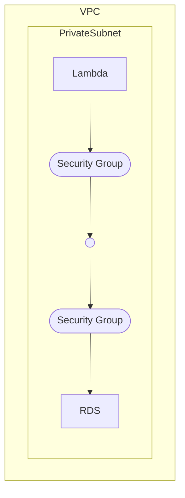
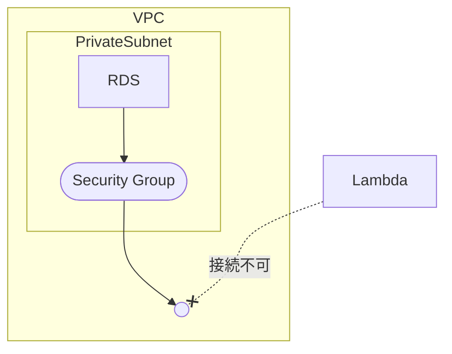
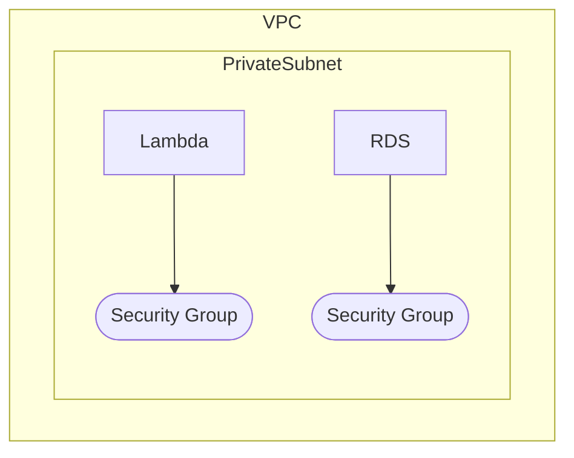
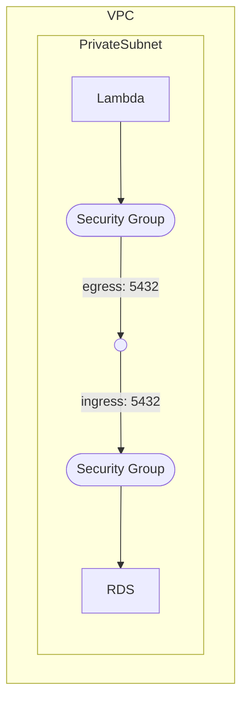

LambdaからRDSへ通信する為には、VPCへの紐付けが必要になります。

以下のように、VPCとSubnetに紐付けたとしてもセキュリティグループがありますから
それぞれに設定をしてあげないと接続が出来ないようになっています。



## 普通に作ると

Lambdaを以下のTerraformのように普通に作成するとVPCにすら紐付いていない状態で作成されます。
その場合、通常接続が出来ません。



```tf
resource "aws_lambda_function" "lambda_function" {
  function_name = local.lambda_function_name
  role          = aws_iam_role.lambda_role.arn
  package_type  = "Image"
  image_uri     = "${local.ecr_registry}/${local.ecr_repository_name}:${local.lambda_image_tag}"
  timeout       = local.lambda_timeout
  memory_size   = local.lamnda_memory_limit
}
```

## VPCに入れる

次にVPCに紐付けてみましょう。

以下のように設定すると、VPCに入ってくれます。

今回はRDSと同じSubnetに入れる事とします。別のSubnetに入れても良いですがルートテーブルなどの設定が必要になるので、大規模なシステムで無い場合は同じSubnetに入れてしまっても良いでしょう。




```tf
# Lambda Function
resource "aws_lambda_function" "lambda_function" {
  function_name = local.lambda_function_name
  role          = aws_iam_role.lambda_role.arn
  package_type  = "Image"
  image_uri     = "${local.ecr_registry}/${local.ecr_repository_name}:${local.lambda_image_tag}"
  timeout       = local.lambda_timeout
  memory_size   = local.lamnda_memory_limit

  dynamic "vpc_config" {
    for_each = can(var.connect_lambda_rds.enabled) ? [1] : []

    content {
      subnet_ids         = var.connect_lambda_rds.subnet_ids
      security_group_ids = [aws_security_group.lambda_sg[0].id]
    }
  }
}

resource "aws_security_group" "lambda_sg" {
  count = var.connect_lambda_rds.enabled ? 1 : 0

  name_prefix = "${local.lambda_function_name}-lambda-sg-"
  vpc_id      = var.connect_lambda_rds.vpc_id
}
```

:::message

モジュールにしている都合でONOFF出来るように改良されています。

:::

この状態だとセキュリティグループで拒否している状態ですので、通信は出来ません。

Lambdaのコンソール画面へ移動してもRDS接続情報に何も表示されません。


## SecurityGroupを設定する

セキュリティグループの設定は、RDS側とLambda側の双方に設定が必要です。

今回RDSはPostgresを利用していますので 5432ポート を双方に許可して上げる必要があります。



```tf
# Lambda Function
resource "aws_lambda_function" "lambda_function" {
  function_name = local.lambda_function_name
  role          = aws_iam_role.lambda_role.arn
  package_type  = "Image"
  image_uri     = "${local.ecr_registry}/${local.ecr_repository_name}:${local.lambda_image_tag}"
  timeout       = local.lambda_timeout
  memory_size   = local.lamnda_memory_limit

  dynamic "vpc_config" {
    for_each = can(var.connect_lambda_rds.enabled) ? [1] : []

    content {
      subnet_ids         = var.connect_lambda_rds.subnet_ids
      security_group_ids = [aws_security_group.lambda_sg[0].id]
    }
  }
}

resource "aws_security_group" "lambda_sg" {
  count = var.connect_lambda_rds.enabled ? 1 : 0

  name_prefix = "${local.lambda_function_name}-lambda-sg-"
  vpc_id      = var.connect_lambda_rds.vpc_id

  egress {
    from_port       = 5432
    to_port         = 5432
    protocol        = "tcp"
    security_groups = var.connect_lambda_rds.rds_security_group_ids
  }
}

# RDS へのインバウンドルールでLambdaを許可
resource "aws_security_group_rule" "rds_sg" {
  for_each = toset(var.connect_lambda_rds.rds_security_group_ids)

  type                     = "ingress"
  from_port                = 5432
  to_port                  = 5432
  protocol                 = "tcp"
  source_security_group_id = aws_security_group.lambda_sg[0].id
  security_group_id        = each.value
}

```

RDS側のセキュリティグループは別途作成済みのため、 `aws_security_group_rule` でルールのみの追加をしています。

これで、双方の接続が許可されたため、RDSへの接続が可能になります。

## 補足

今は直接RDSと接続をしていますが、API Gatewayなどで膨大な接続量が見込まれる場合はRDSへの負荷を考慮して `RDS Proxy` の検討をしましょう。
`RDS Proxy` を利用する事で、増大するRDSへの接続数による負荷が軽減されます。

https://docs.aws.amazon.com/ja_jp/AmazonRDS/latest/UserGuide/rds-proxy.html

RDS Proxyは別途料金が発生するため、1日に数回程度の接続しか無いようなLambdaの場合は直接接続してしまっても大きな問題にはならないかと思います。
適宜ご判断をお願いいたします。

## 最後に

LambdaからRDSに接続するのはあまり望ましくないような気がしますが、、1日数回程度のバッチ処理などそこまで重たくない処理をサーバレスで実施したい場合などには活用出来ると思います。
私はDynamoDBなどで終わらせてしまう事が多いですが、NoSQLはそれはそれで苦労が待ってる事も多いので、適宜状況に合わせてRDBMSと併用活用すると良いのかなと思います。

