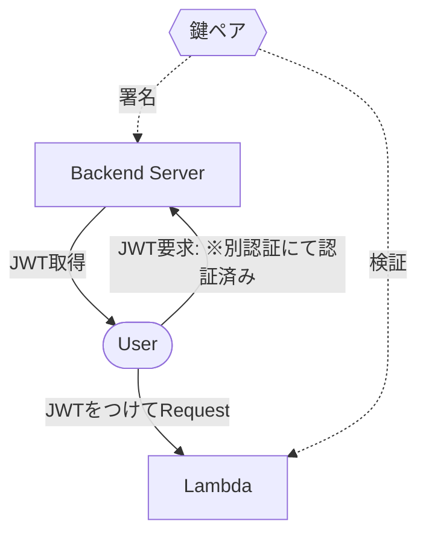

前回の記事の続きです。

今回はAPI GatewayにJWT認証を導入して認証機能を追加します。

## API Gatewayの認証について

AWS API Gatewayと言えば Cognitoによる認証で、よく利用されるかと思います。

https://dev.classmethod.jp/articles/api-gateway-cognito-authorizer/

ただ、WebSocketのエンドポイント一つのためにCognitoを導入するのは非常にコスパが悪く、軽く認証を入れたい場合には向いていません。

手軽に認証を実現したい。。 そういったときに便利なのがJWT認証です。

## JWT認証を使う

JWT認証については深く解説しませんが、公開鍵・秘密鍵の鍵ペアのうち、秘密鍵を使って特定のペイロードに署名をおこない、公開鍵で解錠することにより認証を実現します。



鍵ペアのうち、公開鍵をLambdaに登録しておく事で署名されたTokenを検証することが出来ます。

## JWT認証を行う為に鍵ペア作成とLambdaへのアタッチを行う

Lambdaの作成まで実施してしまっていますが、環境変数に公開鍵を登録するところまで記載しています。

```tf
# API Gateway に対してJWT認証をする為の鍵ペア作成

# 公開鍵と秘密鍵の生成
resource "tls_private_key" "chat_websocket_handler_connect_key" {
  algorithm = "RSA"
  rsa_bits  = 2048
}

resource "tls_self_signed_cert" "chat_websocket_handler_connect_cert" {
  private_key_pem = tls_private_key.chat_websocket_handler_connect_key.private_key_pem

  subject {
    common_name  = "${local.lambda_name}-key"
    organization = "UNILORN"
  }

  validity_period_hours = 87600 # 10 year

  allowed_uses = [
    "key_encipherment",
    "digital_signature",
    "server_auth",
  ]
}

# 公開鍵を取得
data "tls_public_key" "chat_websocket_handler_connect_public_key" {
  private_key_pem = tls_private_key.chat_websocket_handler_connect_key.private_key_pem
}

# 生成した鍵をAWS Secrets Managerに保存
resource "aws_secretsmanager_secret" "chat_websocket_handler_connect_key" {
  name = "${local.lambda_name}-key"
}

# Secret Manager version作成
resource "aws_secretsmanager_secret_version" "chat_websocket_handler_connect_key" {
  secret_id     = aws_secretsmanager_secret.chat_websocket_handler_connect_key.id
  secret_string = <<-EOT
  {
    "private_key": "${tls_private_key.chat_websocket_handler_connect_key.private_key_pem}",
    "public_key": "${data.tls_public_key.chat_websocket_handler_connect_public_key.public_key_pem}"
  }
  EOT
}

# Lambda Function
resource "aws_lambda_function" "chat_websocket_handler_connect" {
  depends_on = [
    aws_iam_role.chat_websocket_handler_connect_lambda_role,
    module.ecr
  ]
  function_name = local.lambda_name
  role          = aws_iam_role.chat_websocket_handler_connect_lambda_role.arn
  package_type  = "Image"
  image_uri     = "${local.ecr_registry}/${local.lambda_image_ecr_repository_name}:${var.api_gateway_websocket_connection_lambda_image_tag}"
  timeout       = 30

  environment {
    variables = {
      #
      # 公開鍵をLambdaの環境変数に登録する
      #
      PUBLIC_KEY                         = data.tls_public_key.chat_websocket_handler_connect_public_key.public_key_pem
      DYNAMO_TABLE_NAME_CHAT_CONNECTIONS = aws_dynamodb_table.chat_connection.name
    }
  }
}

```

ソース上のコメントアウトに記載している通りですが、鍵ペアの作成などもTerraformで実施出来ますので非常に簡単に登録ができています。
AWS Secret Managerに登録しているので、別途BackendServerに送りたい場合はSecretManagerから取得して利用する事になります。

## JWT検証 - Golang

LambdaではGolangを用いてJWTの検証を行います。
`PUBLIC_KEY` 環境変数に公開鍵を入れましたので、リクエストされた `tokenString` に基づいて検証します。

Tokenの有効期限をToken内のペイロードに入れている為、有効期限チェックも同時に実施しています。

```go
func verifyToken(tokenString string) error {
	pubPEM := os.Getenv("PUBLIC_KEY")

	// Parse PEM formatted public key
	block, _ := pem.Decode([]byte(pubPEM))
	if block == nil {
		return fmt.Errorf("failed to decode public key")
	}

	// Parse public key into x509 format
	pubKey, err := x509.ParsePKIXPublicKey(block.Bytes)
	if err != nil {
		return fmt.Errorf("failed to parse public key: %w", err)
	}

	// Ensure public key is in RSA format
	rsaPubKey, ok := pubKey.(*rsa.PublicKey)
	if !ok {
		return fmt.Errorf("public key is not in RSA format")
	}

	// Parse JWT token and verify signature
	token, err := jwt.Parse(tokenString, func(token *jwt.Token) (interface{}, error) {
		// Verify token signing method is RSA
		if _, ok := token.Method.(*jwt.SigningMethodRSA); !ok {
			return nil, fmt.Errorf("unexpected signing method: %v", token.Header["alg"])
		}
		return rsaPubKey, nil
	})

	if err != nil {
		return fmt.Errorf("failed to parse token or verify signature: %w", err)
	}

	if claims, ok := token.Claims.(jwt.MapClaims); ok {
		if exp, ok := claims["exp"].(float64); ok {
			if time.Now().Unix() > int64(exp) {
				return fmt.Errorf("token has expired")
			}
		}
	} else {
		return fmt.Errorf("invalid token claims")
	}


	return nil // Successfully verified signature
}
```

## JWT署名 - PHP


AWS Secret Manager からPrivateKeyを参照し、JWT署名を実施します。

今回Backend ServerではPHPを利用していましたのでPHPで記載します。

```php
/**
 * Create a JWT token
 *
 * @param string $room_id Room identifier
 * @param int $issued_at Token issue timestamp
 * @param int $expired_at Token expiration timestamp
 * @return string JWT token
 * @throws RuntimeException If signing operation fails
 */
private function createJWT(string $room_id, int $issued_at, int $expired_at): string
{
        $private_key = config('jwt.private_key');
    if (empty($private_key)) {
        throw new RuntimeException('Private key is not configured');
    }

    // Create token header
    $header = json_encode([
        'typ' => 'JWT',
        'alg' => 'RS256'
    ], JSON_UNESCAPED_SLASHES);
    if ($header === false) {
        throw new RuntimeException('Failed to encode header');
    }

    // Create token payload
    $payload = json_encode([
        'sub' => $room_id,
        'iat' => $issued_at,
        'exp' => $expired_at
    ], JSON_UNESCAPED_SLASHES);
    if ($payload === false) {
        throw new RuntimeException('Failed to encode payload');
    }

    // Create unsigned token
    $unsignedToken = $this->base64UrlEncode($header) . '.' . $this->base64UrlEncode($payload);

    // Sign the token
    if (!openssl_sign($unsignedToken, $signature, $private_key, OPENSSL_ALGO_SHA256)) {
        throw new RuntimeException('Failed to sign token');
    }

    // Return complete JWT token
    return $unsignedToken . '.' . $this->base64UrlEncode($signature);
}

/**
 * Encode string to base64url format
 *
 * @param string $data Data to encode
 * @return string Base64url encoded string
 */
private function base64UrlEncode(string $data): string
{
    return rtrim(strtr(base64_encode($data), '+/', '-_'), '=');
}
```

どの言語でも大体似たような処理になりますが、JWTによる署名を実施しています。

`sub` や `iat`, `exp` に権限付与されたレコードを入れるようにしています。

今回は特定のRoomへのアクセス許可を実施するコードとなるため、 `sub` にはRoomIDを入れるようにしています。

## まとめ

JWT認証を用いて、API Gatewayを経由してLambdaにフルアクセス出来てしまう状態を権限のあるユーザのみにアクセス可能にする方法を記載しました。
違った言語でも対応しているため、非常に扱いやすいものとなっています。

## 次回: DynamoDBによるコネクション管理

次に、WebSocketAPIにアクセスしてきたクライアントに対してメッセージを投げるために、コネクション管理をしなくてはいけない為
それらをDynamoDBを用いてコネクション管理を実施してみます。

