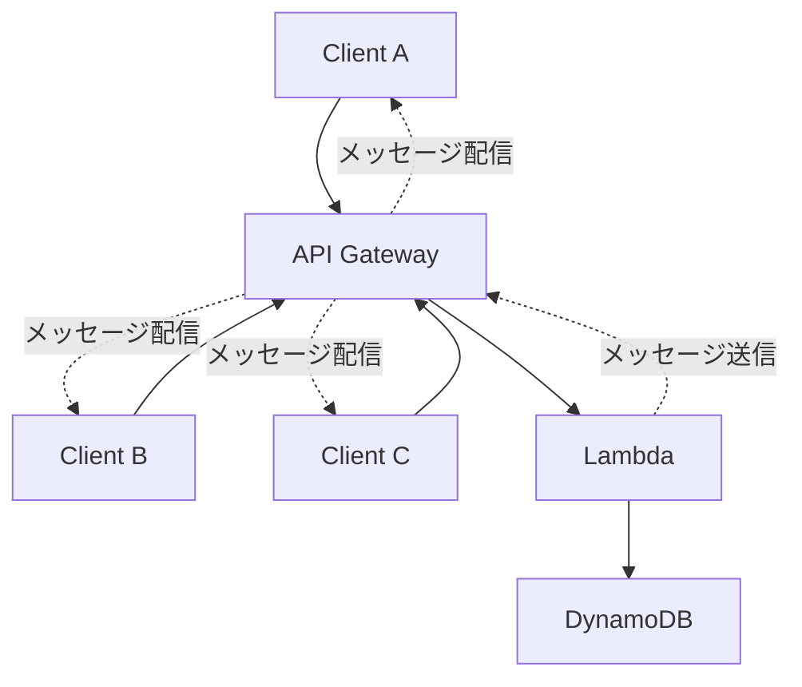

前回の記事の続きです。

今回はDynamoDBを使ったWebSocketコネクション管理について解説します。

## WebSocketコネクション管理の必要性

WebSocketAPIを使用する際、最も重要なことの一つがコネクションの管理です。



クライアントがWebSocketに接続すると、API Gatewayは一意のコネクションIDを生成します。
このコネクションIDを使って、特定のクライアントにメッセージを送信したり、ブロードキャスト配信を行うことができます。

しかし、どのクライアントがどのコネクションIDを持っているかを管理する必要があります。
そこで活躍するのがDynamoDBです。

## DynamoDBテーブルの設計

WebSocketコネクション管理のためのDynamoDBテーブルを設計します。

```tf
# DynamoDB テーブル - WebSocket コネクション管理
resource "aws_dynamodb_table" "chat_connection" {
  name           = "chat_connections"
  billing_mode   = "PAY_PER_REQUEST"
  hash_key       = "connection_id"

  attribute {
    name = "connection_id"
    type = "S"
  }

  attribute {
    name = "room_id"
    type = "S"
  }

  attribute {
    name = "user_id"
    type = "S"
  }

  attribute {
    name = "ttl"
    type = "N"
  }

  # TTL設定 - 古いコネクションを自動削除
  ttl {
    attribute_name = "ttl"
    enabled        = true
  }

  # room_idでクエリするためのGSI
  global_secondary_index {
    name     = "room_id-index"
    hash_key = "room_id"
  }

  # user_idでクエリするためのGSI
  global_secondary_index {
    name     = "user_id-index"
    hash_key = "user_id"
  }

  tags = {
    Name = "chat_connections"
  }
}
```

- `connection_id`: プライマリキー（API Gatewayが生成する一意ID）
- `room_id`: チャットルームのID
- `user_id`: ユーザーのID
- `ttl`: Time To Live（自動削除用）
- GSI（グローバルセカンダリインデックス）で効率的なクエリを実現

## Lambda関数の実装 - コネクション管理

### $connect ハンドラー

WebSocket接続時にコネクション情報をDynamoDBに保存します。

```go
package main

import (
	"context"
	"encoding/json"
	"fmt"
	"os"
	"strconv"
	"time"

	"github.com/aws/aws-lambda-go/events"
	"github.com/aws/aws-lambda-go/lambda"
	"github.com/aws/aws-sdk-go-v2/aws"
	"github.com/aws/aws-sdk-go-v2/config"
	"github.com/aws/aws-sdk-go-v2/service/dynamodb"
	"github.com/aws/aws-sdk-go-v2/service/dynamodb/types"
)

type ConnectionData struct {
	ConnectionID string `json:"connection_id"`
	RoomID       string `json:"room_id"`
	UserID       string `json:"user_id"`
	TTL          int64  `json:"ttl"`
	CreatedAt    string `json:"created_at"`
}

var dynamoClient *dynamodb.Client
var tableName string

func init() {
	cfg, err := config.LoadDefaultConfig(context.TODO())
	if err != nil {
		panic(fmt.Sprintf("unable to load SDK config, %v", err))
	}
	dynamoClient = dynamodb.NewFromConfig(cfg)
	tableName = os.Getenv("DYNAMO_TABLE_NAME_CHAT_CONNECTIONS")
}

func connectHandler(ctx context.Context, request events.APIGatewayWebsocketProxyRequest) (events.APIGatewayProxyResponse, error) {
	// JWT検証（前回の記事で実装済み）
	tokenString := request.QueryStringParameters["token"]
	if tokenString == "" {
		return events.APIGatewayProxyResponse{
			StatusCode: 401,
			Body:       "Unauthorized: missing token",
		}, nil
	}

	if err := verifyToken(tokenString); err != nil {
		return events.APIGatewayProxyResponse{
			StatusCode: 401,
			Body:       fmt.Sprintf("Unauthorized: %v", err),
		}, nil
	}

	// JWTからroom_idとuser_idを取得
	roomID := request.QueryStringParameters["room_id"]
	userID := request.QueryStringParameters["user_id"]

	if roomID == "" || userID == "" {
		return events.APIGatewayProxyResponse{
			StatusCode: 400,
			Body:       "Bad Request: missing room_id or user_id",
		}, nil
	}

	// コネクション情報を作成
	connectionData := ConnectionData{
		ConnectionID: request.RequestContext.ConnectionID,
		RoomID:       roomID,
		UserID:       userID,
		TTL:          time.Now().Add(24 * time.Hour).Unix(), // 24時間後に自動削除
		CreatedAt:    time.Now().Format(time.RFC3339),
	}

	// DynamoDBに保存
	item := map[string]types.AttributeValue{
		"connection_id": &types.AttributeValueMemberS{Value: connectionData.ConnectionID},
		"room_id":       &types.AttributeValueMemberS{Value: connectionData.RoomID},
		"user_id":       &types.AttributeValueMemberS{Value: connectionData.UserID},
		"ttl":           &types.AttributeValueMemberN{Value: strconv.FormatInt(connectionData.TTL, 10)},
		"created_at":    &types.AttributeValueMemberS{Value: connectionData.CreatedAt},
	}

	_, err := dynamoClient.PutItem(ctx, &dynamodb.PutItemInput{
		TableName: aws.String(tableName),
		Item:      item,
	})

	if err != nil {
		return events.APIGatewayProxyResponse{
			StatusCode: 500,
			Body:       fmt.Sprintf("Internal Server Error: %v", err),
		}, nil
	}

	return events.APIGatewayProxyResponse{
		StatusCode: 200,
		Body:       "Connected successfully",
	}, nil
}

func main() {
	lambda.Start(connectHandler)
}
```

### $disconnect ハンドラー

WebSocket切断時にコネクション情報をDynamoDBから削除します。

```go
func disconnectHandler(ctx context.Context, request events.APIGatewayWebsocketProxyRequest) (events.APIGatewayProxyResponse, error) {
	// DynamoDBからコネクション情報を削除
	_, err := dynamoClient.DeleteItem(ctx, &dynamodb.DeleteItemInput{
		TableName: aws.String(tableName),
		Key: map[string]types.AttributeValue{
			"connection_id": &types.AttributeValueMemberS{Value: request.RequestContext.ConnectionID},
		},
	})

	if err != nil {
		return events.APIGatewayProxyResponse{
			StatusCode: 500,
			Body:       fmt.Sprintf("Internal Server Error: %v", err),
		}, nil
	}

	return events.APIGatewayProxyResponse{
		StatusCode: 200,
		Body:       "Disconnected successfully",
	}, nil
}
```

## メッセージ送信機能の実装

### 特定のルームへメッセージを送信

```go
func sendMessageHandler(ctx context.Context, request events.APIGatewayWebsocketProxyRequest) (events.APIGatewayProxyResponse, error) {
	var messageData struct {
		RoomID  string `json:"room_id"`
		Message string `json:"message"`
	}

	if err := json.Unmarshal([]byte(request.Body), &messageData); err != nil {
		return events.APIGatewayProxyResponse{
			StatusCode: 400,
			Body:       "Bad Request: invalid JSON",
		}, nil
	}

	// 指定されたroomに接続している全てのコネクションを取得
	connections, err := getConnectionsByRoomID(ctx, messageData.RoomID)
	if err != nil {
		return events.APIGatewayProxyResponse{
			StatusCode: 500,
			Body:       fmt.Sprintf("Internal Server Error: %v", err),
		}, nil
	}

	// API Gateway Management APIクライアントを作成
	apiGatewayURL := fmt.Sprintf("https://%s.execute-api.%s.amazonaws.com/%s",
		request.RequestContext.APIID,
		os.Getenv("AWS_REGION"),
		request.RequestContext.Stage,
	)

	managementConfig, err := config.LoadDefaultConfig(ctx)
	if err != nil {
		return events.APIGatewayProxyResponse{
			StatusCode: 500,
			Body:       fmt.Sprintf("Failed to load AWS config: %v", err),
		}, nil
	}

	managementClient := apigatewaymanagementapi.NewFromConfig(managementConfig, func(o *apigatewaymanagementapi.Options) {
		o.BaseEndpoint = aws.String(apiGatewayURL)
	})

	// 各コネクションにメッセージを送信
	for _, connection := range connections {
		messageBytes, _ := json.Marshal(map[string]interface{}{
			"action":  "message",
			"room_id": messageData.RoomID,
			"message": messageData.Message,
			"timestamp": time.Now().Format(time.RFC3339),
		})

		_, err := managementClient.PostToConnection(ctx, &apigatewaymanagementapi.PostToConnectionInput{
			ConnectionId: aws.String(connection.ConnectionID),
			Data:         messageBytes,
		})

		if err != nil {
			// コネクションが無効な場合はDynamoDBから削除
			if isConnectionGone(err) {
				deleteConnection(ctx, connection.ConnectionID)
			}
		}
	}

	return events.APIGatewayProxyResponse{
		StatusCode: 200,
		Body:       "Message sent successfully",
	}, nil
}

func getConnectionsByRoomID(ctx context.Context, roomID string) ([]ConnectionData, error) {
	result, err := dynamoClient.Query(ctx, &dynamodb.QueryInput{
		TableName:              aws.String(tableName),
		IndexName:              aws.String("room_id-index"),
		KeyConditionExpression: aws.String("room_id = :room_id"),
		ExpressionAttributeValues: map[string]types.AttributeValue{
			":room_id": &types.AttributeValueMemberS{Value: roomID},
		},
	})

	if err != nil {
		return nil, err
	}

	var connections []ConnectionData
	for _, item := range result.Items {
		var connection ConnectionData
		// DynamoDBの結果をパース
		if connID, ok := item["connection_id"].(*types.AttributeValueMemberS); ok {
			connection.ConnectionID = connID.Value
		}
		if roomID, ok := item["room_id"].(*types.AttributeValueMemberS); ok {
			connection.RoomID = roomID.Value
		}
		if userID, ok := item["user_id"].(*types.AttributeValueMemberS); ok {
			connection.UserID = userID.Value
		}
		connections = append(connections, connection)
	}

	return connections, nil
}

func isConnectionGone(err error) bool {
	// API Gateway Management APIのエラーを確認
	// 410 Gone や 403 Forbidden の場合は無効なコネクション
	return true // 簡略化
}

func deleteConnection(ctx context.Context, connectionID string) {
	dynamoClient.DeleteItem(ctx, &dynamodb.DeleteItemInput{
		TableName: aws.String(tableName),
		Key: map[string]types.AttributeValue{
			"connection_id": &types.AttributeValueMemberS{Value: connectionID},
		},
	})
}
```

## Terraformでの追加設定

Lambda関数にDynamoDBアクセス権限を付与し、API Gateway Management APIの権限も追加します。

```tf
# Lambda実行ロールにDynamoDBアクセス権限を追加
resource "aws_iam_role_policy" "chat_websocket_lambda_dynamodb_policy" {
  name = "chat_websocket_lambda_dynamodb_policy"
  role = aws_iam_role.chat_websocket_handler_connect_lambda_role.id

  policy = jsonencode({
    Version = "2012-10-17"
    Statement = [
      {
        Effect = "Allow"
        Action = [
          "dynamodb:PutItem",
          "dynamodb:GetItem",
          "dynamodb:DeleteItem",
          "dynamodb:Query",
          "dynamodb:Scan"
        ]
        Resource = [
          aws_dynamodb_table.chat_connection.arn,
          "${aws_dynamodb_table.chat_connection.arn}/index/*"
        ]
      },
      {
        Effect = "Allow"
        Action = [
          "execute-api:ManageConnections"
        ]
        Resource = "arn:aws:execute-api:${data.aws_region.current.name}:${data.aws_caller_identity.current.account_id}:${aws_apigatewayv2_api.chat_websocket.id}/*"
      }
    ]
  })
}

# $disconnect用のLambda関数
resource "aws_lambda_function" "chat_websocket_handler_disconnect" {
  function_name = "${local.lambda_name}-disconnect"
  role          = aws_iam_role.chat_websocket_handler_connect_lambda_role.arn
  package_type  = "Image"
  image_uri     = "${local.ecr_registry}/${local.lambda_image_ecr_repository_name}:${var.api_gateway_websocket_disconnect_lambda_image_tag}"
  timeout       = 30

  environment {
    variables = {
      DYNAMO_TABLE_NAME_CHAT_CONNECTIONS = aws_dynamodb_table.chat_connection.name
    }
  }
}

# メッセージ送信用のLambda関数
resource "aws_lambda_function" "chat_websocket_handler_send_message" {
  function_name = "${local.lambda_name}-send-message"
  role          = aws_iam_role.chat_websocket_handler_connect_lambda_role.arn
  package_type  = "Image"
  image_uri     = "${local.ecr_registry}/${local.lambda_image_ecr_repository_name}:${var.api_gateway_websocket_send_message_lambda_image_tag}"
  timeout       = 30

  environment {
    variables = {
      DYNAMO_TABLE_NAME_CHAT_CONNECTIONS = aws_dynamodb_table.chat_connection.name
    }
  }
}

# $disconnect用のAPI Gateway設定
resource "aws_apigatewayv2_route" "chat_websocket_disconnect" {
  api_id    = aws_apigatewayv2_api.chat_websocket.id
  route_key = "$disconnect"
  target    = "integrations/${aws_apigatewayv2_integration.chat_websocket_disconnect.id}"
}

resource "aws_apigatewayv2_integration" "chat_websocket_disconnect" {
  api_id             = aws_apigatewayv2_api.chat_websocket.id
  integration_type   = "AWS_PROXY"
  integration_method = "POST"
  integration_uri    = aws_lambda_function.chat_websocket_handler_disconnect.invoke_arn
}

# sendMessage用のAPI Gateway設定
resource "aws_apigatewayv2_route" "chat_websocket_send_message" {
  api_id    = aws_apigatewayv2_api.chat_websocket.id
  route_key = "sendMessage"
  target    = "integrations/${aws_apigatewayv2_integration.chat_websocket_send_message.id}"
}

resource "aws_apigatewayv2_integration" "chat_websocket_send_message" {
  api_id             = aws_apigatewayv2_api.chat_websocket.id
  integration_type   = "AWS_PROXY"
  integration_method = "POST"
  integration_uri    = aws_lambda_function.chat_websocket_handler_send_message.invoke_arn
}

# Lambda実行権限
resource "aws_lambda_permission" "disconnect_handler" {
  statement_id  = "AllowExecutionFromAPIGateway"
  action        = "lambda:InvokeFunction"
  function_name = aws_lambda_function.chat_websocket_handler_disconnect.function_name
  principal     = "apigateway.amazonaws.com"
  source_arn    = "arn:aws:execute-api:${data.aws_region.current.name}:${data.aws_caller_identity.current.account_id}:${aws_apigatewayv2_api.chat_websocket.id}/*/$disconnect"
}

resource "aws_lambda_permission" "send_message_handler" {
  statement_id  = "AllowExecutionFromAPIGateway"
  action        = "lambda:InvokeFunction"
  function_name = aws_lambda_function.chat_websocket_handler_send_message.function_name
  principal     = "apigateway.amazonaws.com"
  source_arn    = "arn:aws:execute-api:${data.aws_region.current.name}:${data.aws_caller_identity.current.account_id}:${aws_apigatewayv2_api.chat_websocket.id}/*/sendMessage"
}
```

## 動作確認

実際にWebSocketに接続してメッセージの送受信を確認してみましょう。

JavaScriptのクライアントサンプル：

```javascript
// WebSocket接続
const token = "your-jwt-token";
const roomId = "room-123";
const userId = "user-456";

const ws = new WebSocket(`wss://your-api-gateway-url.execute-api.region.amazonaws.com/dev?token=${token}&room_id=${roomId}&user_id=${userId}`);

ws.onopen = function(event) {
    console.log('WebSocket connection established');
};

ws.onmessage = function(event) {
    const message = JSON.parse(event.data);
    console.log('Received message:', message);
};

ws.onerror = function(error) {
    console.error('WebSocket error:', error);
};

// メッセージ送信
function sendMessage(message) {
    const data = {
        action: "sendMessage",
        room_id: roomId,
        message: message
    };
    ws.send(JSON.stringify(data));
}

// 使用例
sendMessage("Hello, World!");
```

## 監視とメトリクス

DynamoDBテーブルの読み書きとWebSocketコネクション数の監視を追加します。

```tf
# CloudWatch Alarm - DynamoDB読み取り容量
resource "aws_cloudwatch_metric_alarm" "dynamodb_read_throttle" {
  alarm_name          = "chat-connections-read-throttle"
  comparison_operator = "GreaterThanThreshold"
  evaluation_periods  = "2"
  metric_name         = "ReadThrottleEvents"
  namespace           = "AWS/DynamoDB"
  period              = "300"
  statistic           = "Sum"
  threshold           = "0"
  alarm_description   = "DynamoDB read throttle events"

  dimensions = {
    TableName = aws_dynamodb_table.chat_connection.name
  }
}

# CloudWatch Alarm - WebSocket接続数
resource "aws_cloudwatch_metric_alarm" "websocket_connection_count" {
  alarm_name          = "websocket-high-connection-count"
  comparison_operator = "GreaterThanThreshold"
  evaluation_periods  = "2"
  metric_name         = "ConnectCount"
  namespace           = "AWS/ApiGateway"
  period              = "300"
  statistic           = "Sum"
  threshold           = "1000"
  alarm_description   = "High WebSocket connection count"

  dimensions = {
    ApiName = aws_apigatewayv2_api.chat_websocket.name
  }
}
```

## まとめ

DynamoDBを使ったWebSocketコネクション管理について解説しました。

- DynamoDBのTTL機能を使った自動削除
- GSI（グローバルセカンダリインデックス）による効率的なクエリ
- API Gateway Management APIを使ったメッセージ送信
- 無効なコネクションの自動削除

これで、スケーラブルなWebSocketアプリケーションの基盤が完成しました。
DynamoDBのサーバーレス特性により、接続数に応じた自動スケーリングが可能です。

