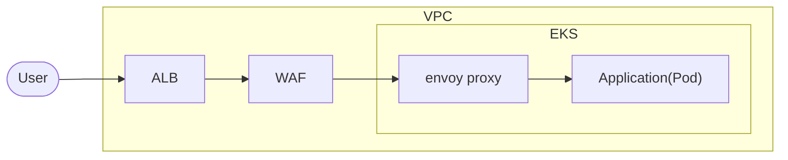

皆さんはSocket通信を利用されているでしょうか。
私は結構な頻度で使っています。

例えば、外部に公開していないネットワーク内部の端末からデータを吸い上げたい時皆さんはどうしていますか？

VPNを張ったり..? 

こういったケースではSocket通信をすると比較的簡単に実装できます。

https://tech-blog.optim.co.jp/entry/2022/05/30/100000

私が執筆した記事ですが、この技術もSocket通信を応用しています。

## WebSocketやHTTP Keep-Alive,Persistentを利用した懸念点

https://tex2e.github.io/rfc-translater/html/rfc7540.html

> 9.1. Connection Management
> 
> HTTP/2 connections are persistent. 

このあたりを見ても、接続管理に非常に苦労することが分かります。

インフラの構成として、WAFたALB、リバースプロキシ（Envoyやistio）を導入する事は昨今のデファクトだと思いますが、
これらに共通する点としてはL7で終端していると言うことです。



もちろん、マイクロサービスアーキテクチャを採用してAPIサーバが乱立しているような状況だった場合、L7で終端している箇所で必ずコネクション管理が必要になります。

Websocketに関しては、TCPやHTTP以上に Ping Pongなどの追加処理も発生します。

https://datatracker.ietf.org/doc/html/rfc6455#section-5.5.2

これらのコネクション維持に関する品質を担保しようと思うと、かなり細かい実装が必要になり、バグが発生した場合に影響範囲が広すぎて追えないことが非常に多く存在すると思います。

## 実際に発生した影響

Websocket接続を行っていた際に突然コネクションが切断されたのですが、サーバ側はそれを検知出来ていない。。
といった状況に出くわしました。

その障害内容について深く追求はしませんが、どうやらALBやWAFなどがコネクションを張りっぱなしで切断を検知出来ていない状況に陥ったらしく、PingPongのタイムアウトまで数秒間つながっていないような現象がありました。

こういったことが発生する原因は、紛れもなく自前で諸々の実装をしているからです。
正しい知識で深いドメイン知識を持っている状態になって運用保守するのなら良いですが、会社勤めをしていたらそうはいかない場合があります。

なので、「万人がある程度の知識量でも簡単に運用保守できる状態」というのが良かったりもします。

※もちろん、AWS API Gatewayにロックインしてしまうというデメリットもありますので、メリデメをしっかり整理した上でリスクをどう評価するかを吟味してください。

## AWS API Gateway

https://aws.amazon.com/jp/api-gateway/ 

> フルマネージド型サービスの Amazon API Gateway を利用すれば、デベロッパーは規模にかかわらず簡単に API の作成、公開、保守、モニタリング、保護を行えます。API は、アプリケーションがバックエンドサービスからのデータ、ビジネスロジック、機能にアクセスするための「フロントドア」として機能します。API Gateway を使用すれば、リアルタイム双方向通信アプリケーションを実現する RESTful API および WebSocket API を作成することができます。API Gateway は、コンテナ化されたサーバーレスのワークロードやウェブアプリケーションをサポートします。


※公式サイト引用

記述の通りですが、今回はSocket通信にフォーカスを置いていますので `WebSocket API` を利用します。

> チャットアプリケーション、ストリーミングダッシュボードといったリアルタイム双方向通信アプリケーションは、WebSocket API を使用して構築できます。API Gateway は、バックエンドサービスとクライアント間のメッセージ転送を処理するために永続的な接続を維持します。

と書かれている通り、コネクションを張るという偉大な作業をマネージドしてくれます。非常にありがたいですね。

https://docs.aws.amazon.com/apigateway/latest/developerguide/websocket-api-chat-app.html

チュートリアルにもありますが、WebSocket APIではLambdaを中心として `$connect` などの識別子によってコネクション発生時にリクエストを捌いたりなどすることが出来ます。


## Terraform で構築する

リソースとしては単純で以下のリソースでAPI Gatewayは構築出来ます。
ただ、どこにも接続されていないのでLambdaなどと一緒にRoute等の設定も追加する必要があります。

```tf
resource "aws_apigatewayv2_api" "chat_websocket" {
  name                       = "chat_websocket"
  protocol_type              = "WEBSOCKET"
  description                = "Realtime Chat Socket Connections"
  route_selection_expression = "$request.body.action"
}
```

全リソースを解説してると日が暮れるので、とりあえず動くコードを記述しておきます。


```tf
# APIでいうエンドポイント, ここでは $coonect（接続時）のリソース
resource "aws_apigatewayv2_route" "chat_websocket_connet" {
  api_id    = aws_apigatewayv2_api.chat_websocket.id
  route_key = "$connect"
  target    = "integrations/${aws_apigatewayv2_integration.chat_websocket_connet.id}"
}

# Lambdaと紐付けているリソース Lambdaに対してPOSTメソッドとして実行される
resource "aws_apigatewayv2_integration" "chat_websocket_connet" {
  api_id             = aws_apigatewayv2_api.chat_websocket.id
  integration_type   = "AWS_PROXY"
  integration_method = "POST"
  integration_uri    = aws_lambda_function.chat_websocket_handler_connect.invoke_arn
}

# デプロイメントステージの管理
resource "aws_apigatewayv2_stage" "chat_websocket_stage" {
  api_id = aws_apigatewayv2_api.chat_websocket.id
  name   = "chat_websocket"

  default_route_settings {
    data_trace_enabled       = true
    detailed_metrics_enabled = true
    logging_level            = "INFO"
    throttling_burst_limit   = 5000
    throttling_rate_limit    = 10000
  }

  deployment_id = aws_apigatewayv2_deployment.chat_websocket_deployment.id
  depends_on    = [aws_apigatewayv2_deployment.chat_websocket_deployment]

  access_log_settings {
    destination_arn = aws_cloudwatch_log_group.api_gw.arn
    format          = "$context.identity.sourceIp - - [$context.requestTime] \"$context.httpMethod $context.routeKey $context.protocol\" $context.status $context.responseLength $context.requestId $context.integrationErrorMessage"
  }
}

# デプロイメントの管理
resource "aws_apigatewayv2_deployment" "chat_websocket_deployment" {
  api_id      = aws_apigatewayv2_api.chat_websocket.id
  description = "chat_websocket_deployment"

  triggers = {
    redeployment = sha1(join(",", tolist([
      jsonencode(aws_apigatewayv2_integration.chat_websocket_connet),
      jsonencode(aws_apigatewayv2_route.chat_websocket_connet),
    ])))
  }

  lifecycle {
    create_before_destroy = true
  }
}

# カスタムドメインのアタッチ
resource "aws_apigatewayv2_domain_name" "chat_websocket_domain" {
  domain_name = local.route53_domain_socket_api_gateway

  domain_name_configuration {
    certificate_arn = module.acm.arn
    endpoint_type   = "REGIONAL"
    security_policy = "TLS_1_2"
  }
}

# ステージとカスタムドメインのマッピング
resource "aws_apigatewayv2_api_mapping" "chat_websocket_domain_mapping" {
  api_id      = aws_apigatewayv2_api.chat_websocket.id
  domain_name = aws_apigatewayv2_domain_name.chat_websocket_domain.id
  stage       = aws_apigatewayv2_stage.chat_websocket_stage.id
}

# API GatewayからLambdaを実行する権限を付与するリソース
resource "aws_lambda_permission" "connect_handler" {
  statement_id  = "AllowExecutionFromAPIGateway"
  action        = "lambda:InvokeFunction"
  function_name = aws_lambda_function.chat_websocket_handler_connect.function_name
  principal     = "apigateway.amazonaws.com"
  source_arn    = "arn:aws:execute-api:${data.aws_region.current.name}:${data.aws_caller_identity.current.account_id}:${aws_apigatewayv2_api.chat_websocket.id}/*/${aws_apigatewayv2_route.chat_websocket_connet.route_key}"
}
```

一部別のModuleを参照しているものもありますが、基本は動作すると思います。

- 別で立てているもの
  - Route53, ACMなどドメイン関連
  - Lambda関数

## 動作確認

割り当てたドメイン名でアクセスする事が出来ます。

```sh
wscat -c "wss://******?room_id=***" -H "Authorization:****"
```

ほとんどマスクしていますが、、これで アクセス出来るようになりました。

## 次回: JWT認証

この記事の続きである認証回りの話を引き続きさせていただきます。

今回は基本的な部分の導入の解説でした。
認証の仕組みやLambda周りのPOSTデータの扱い方などは別の記事で解説になります。


