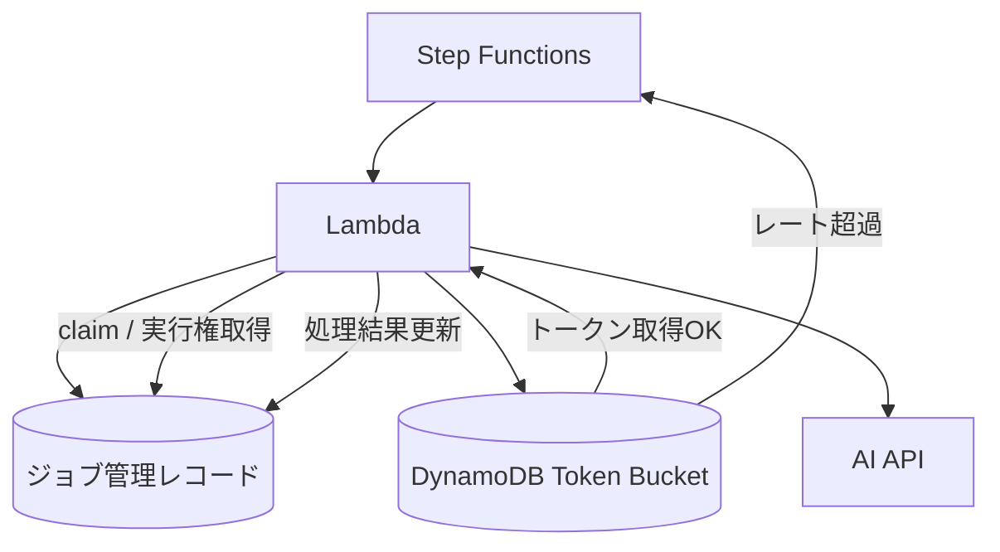

## はじめに

AI API を使った機能を作っていると、Azure OpenAI や Claude、Gemini などの外部 API を 1 つの API キーや接続設定で共有することがよくありますが、レートリミットに困るかなと思います。

今回は、**Amazon DynamoDB をストアにしたトークンバケット方式のレートリミッタ**を使って、外部 AI API を叩く前にユーザー単位の送信ペースを制御する実装パターンを書いてみます。

以下の形にするとかなり扱いやすいです。

- 外部 AI API を呼ぶ前に必ずトークンを 1 つ消費する
- トークンが取れなければ API は呼ばない
- バケットキーに `userId` を使ってユーザー単位で制御する
- 必要なら全体用のバケットも併用して二段で制御する
- 待機は Lambda の中でせず、Step Functions 側で再試行する
- レート超過とシステム障害は別エラーとして扱う

この構成にしておくと、**無駄な AI API リクエストを減らしつつ、特定ユーザーだけが共有枠を食い尽くす状態も抑えやすい**です。

## なぜトークンバケットにするのか

AI API のレート制限に対して、単純に「429 が返ってきたらリトライする」でも動かなくはありません。

ただ、この方式だと以下が起きやすいです。

- すでに制限を超えているのに毎回 API まで到達してしまう
- スロットリング応答を受けるたびに外部 API 呼び出しコストが増える
- Lambda の中で sleep すると実行時間課金が無駄になる
- 水平スケールした複数実行をまとめて制御しづらい
- サービス側の制限が API キー単位なので、ユーザー単位の公平性を作りにくい

そこで、**外部 API の手前に共有レートリミッタを置く**、という発想を取ります。

トークンバケット方式なら、たとえば「1 ユーザーあたり 1 秒に 2 リクエストまで」のような制御を比較的素直に表現できます。

つまり、サービス提供側のレートリミットが粗くても、**アプリケーション側でより細かい制御単位を作れる**わけです。

ただし、ここで 1 つ注意があります。

`userId` 単位の制御を入れても、外部 AI サービス側が持っている **全体の共有上限** までは消えません。

たとえば、

- OpenAI 系の API キー単位の上限
- Azure OpenAI のデプロイメント単位の上限
- モデルごとの RPM / TPM 制限

のようなものは別に存在します。

そのため実運用では、**ユーザー単位の公平性**と**全体上限の保護**を分けて考える必要があります。

## 全体像

今回の構成はこんなイメージです。



ざっくり以下の流れです。

- 実行対象のジョブを取得する
- すでに完了済みか、他の実行が処理中でないかを確認する
- DynamoDB 上のトークンバケットから 1 トークン消費する
- 必要なら全体用バケットからも 1 トークン消費する
- 消費できた場合だけ処理の claim を取る
- その後に AI API を呼ぶ
- レート超過なら Step Functions にエラーを返して再試行に任せる

ポイントは、**AI API に到達する前にゲートを置く**ことです。

## DynamoDB をストアにする理由

Lambda 単体のメモリにカウンタを持たせても、インスタンスごとに状態が分かれるので、全体のレートは制御できません。

そのため、共有ストアが必要になります。

今回のようなケースでは DynamoDB がかなり相性が良いです。

- サーバレスで完結しやすい
- 複数 Lambda から共有しやすい
- TTL 付きの一時データを持たせやすい
- 秒単位の制御用データを置く用途に使いやすい

レートリミットのアルゴリズム自体をフルスクラッチで書くこともできますが、実運用ではライブラリに寄せた方が安全なことが多いです。

この記事の設定値や API 例は、Node.js でよく使われる `rate-limiter-flexible` の `RateLimiterDynamo` にかなり近い考え方です。
Go で書く場合も、その設計を踏襲したラッパーや移植実装として考えるとイメージしやすいと思います。

## 実装イメージ

今回は Go で、DynamoDB をバックエンドにしたレートリミッタをラップする例で書きます。

### 1. トークン消費結果の型を定義する

まずは、呼び出し側が扱いやすい返り値を定義します。

```go
type ConsumeTokenResult struct {
	Success      bool
	Reason       string
	MsBeforeNext int
	ErrorCode    string
}

type TokenBucketRepository interface {
	ConsumeToken(ctx context.Context, key string) (*ConsumeTokenResult, error)
}
```

ここで大事なのは、**想定内の輻輳とシステム障害を分ける**ことです。

同じ「送れない」でも、

- 単に利用枠を使い切ったのか
- レートリミッタ自体が壊れているのか

では、運用上の意味がかなり違います。

### 2. DynamoDB ベースのトークンバケットを作る

レートリミットのストアとして DynamoDB を使います。

```go
const (
	DefaultPoints                  = 2
	DefaultDurationSeconds         = 1
	MinimumRetryWaitMilliseconds   = 1000
	ReasonRateLimited              = "RATE_LIMITED"
	ReasonSystemFailure            = "SYSTEM_FAILURE"
	ErrorCodeRateLimiterConsumeErr = "RATE_LIMITER_CONSUME_FAILED"
)

type DynamoDBTokenBucketRepository struct {
	rateLimiter *RateLimiterDynamo
}

func NewDynamoDBTokenBucketRepository(
	client *dynamodb.Client,
	tableName string,
) *DynamoDBTokenBucketRepository {
	return &DynamoDBTokenBucketRepository{
		rateLimiter: NewRateLimiterDynamo(RateLimiterDynamoConfig{
			StoreClient:  client,
			TableName:    tableName,
			Points:       DefaultPoints,
			Duration:     DefaultDurationSeconds,
			TableCreated: true,
			TTLSet:       true,
		}),
	}
}

func (r *DynamoDBTokenBucketRepository) ConsumeToken(
	ctx context.Context,
	key string,
) (*ConsumeTokenResult, error) {
	res, err := r.rateLimiter.Consume(ctx, key, 1)
	if err == nil {
		return &ConsumeTokenResult{Success: true}, nil
	}

	var rateLimitErr *RateLimitError
	if errors.As(err, &rateLimitErr) {
		msBeforeNext := max(
			MinimumRetryWaitMilliseconds,
			int(math.Ceil(rateLimitErr.MsBeforeNext)),
		)

		return &ConsumeTokenResult{
			Success:      false,
			Reason:       ReasonRateLimited,
			MsBeforeNext: msBeforeNext,
		}, nil
	}

	_ = res

	return &ConsumeTokenResult{
		Success:   false,
		Reason:    ReasonSystemFailure,
		ErrorCode: ErrorCodeRateLimiterConsumeErr,
	}, nil
}
```

この例では、**1 秒あたり 2 トークン**、つまり **1 ユーザーあたり 1 秒に最大 2 リクエスト**のイメージです。

API 呼び出し 1 回ごとに `consume(key, 1)` を呼ぶので、モデルとしてはかなり単純です。

### 3. 送信処理の早い段階でトークンを消費する

次に、実際の送信ユースケース側です。

```go
var (
	ErrRateLimited = errors.New("rate limit exceeded")
)

type SendSystemError struct {
	ErrorCode string
}

func (e *SendSystemError) Error() string {
	return fmt.Sprintf("token bucket system failure: %s", e.ErrorCode)
}

type ExecuteAIJobUseCase struct {
	tokenBucketRepository TokenBucketRepository
	jobRepository         JobRepository
	aiClient              AIClient
}

func (u *ExecuteAIJobUseCase) Execute(
	ctx context.Context,
	jobID string,
	userID string,
	provider string,
	model string,
) error {
	record, err := u.jobRepository.FindByID(ctx, jobID)
	if err != nil {
		return err
	}
	if record == nil || record.IsCompleted() || record.IsRecentlyClaimed() {
		return nil
	}

	userTokenResult, err := u.tokenBucketRepository.ConsumeToken(
		ctx,
		fmt.Sprintf("user:%s", userID),
	)
	if err != nil {
		return err
	}
	if err := ensureToken(userTokenResult); err != nil {
		return err
	}

	globalTokenResult, err := u.tokenBucketRepository.ConsumeToken(
		ctx,
		fmt.Sprintf("global:%s:%s", provider, model),
	)
	if err != nil {
		return err
	}
	if err := ensureToken(globalTokenResult); err != nil {
		return err
	}

	claimed, err := u.jobRepository.ClaimForProcessing(ctx, record)
	if err != nil {
		return err
	}
	if !claimed {
		return nil
	}

	if err := u.aiClient.Execute(ctx, record.Payload); err != nil {
		return err
	}

	return u.jobRepository.MarkAsCompleted(ctx, record.ID)
}

func ensureToken(tokenResult *ConsumeTokenResult) error {
	if tokenResult.Success {
		return nil
	}

	if tokenResult.Reason == ReasonRateLimited {
		return ErrRateLimited
	}

	return &SendSystemError{ErrorCode: tokenResult.ErrorCode}
}
```

見るべきポイントはここです。

- **AI API 呼び出し前**にトークンを消費する
- **ユーザー単位と全体単位の両方**を事前に確認できる
- レート超過なら即終了する
- Lambda の中では待たない
- claim に成功したものだけ実際に API を呼ぶ

要は、AI API の前段に「呼んでよいか」を判断する薄いゲートを置いています。

## バケットキーはユーザー単位にする

キー設計は地味ですが重要です。

例えば以下のように、`userId` を含めてキーを作ります。

```go
tokenBucketKey := fmt.Sprintf("user:%s", userID)
```

この場合、レートリミットは API キー単位ではなく、**アプリケーションが定義したユーザー単位**で効きます。

外部 AI サービス側では、同じ API キーを使っている限りユーザーごとの差は見えないことがあります。
なので、アプリケーション側でこのキー粒度を作らないと、ヘビーユーザーが共有枠を使い切ってしまいやすいです。

もちろん、要件によっては以下のような拡張もありです。

- テナントごとにキーを分ける
- モデルごとにキーを分ける
- 優先度別に複数バケットを持つ

ただ、最初から細かく分けすぎると制御が複雑になるので、**まずはユーザー単位の単純なキーから始める**のが扱いやすいと思います。

一方で、実サービスではユーザー単位だけでは不十分なことも多いです。

例えば以下のように、二段で持つと分かりやすいです。

```go
userBucketKey := fmt.Sprintf("user:%s", userID)
globalBucketKey := fmt.Sprintf("global:%s:%s", provider, model)
```

- `userBucketKey`: 特定ユーザーの使いすぎを抑える
- `globalBucketKey`: 共有 API キー全体の上限超過を抑える

この二段構えにしておくと、アプリケーション都合の公平性と、外部 API 都合の保護を分けて設計できます。

## Lambda では待たず、Step Functions に戻す

ここはかなり実運用寄りの話ですが、レート超過時に Lambda の中で `sleep` しない方が楽です。

理由は単純で、

- 待機中も実行時間課金が発生する
- 同時実行枠を無駄に保持しやすい
- 再試行戦略をコードに埋め込みすぎる

からです。

そのため、レート超過時は `RateLimitError` を投げて、Step Functions 側で再試行させます。

```json
{
  "Retry": [
    {
      "ErrorEquals": ["RateLimitError"],
      "IntervalSeconds": 1,
      "BackoffRate": 2.0,
      "MaxAttempts": 6
    }
  ]
}
```

こうしておくと、再試行ポリシーはワークフロー側で調整できます。

**API 実行可否の判定は Lambda、待機と再実行は Step Functions** と責務を分けるのが綺麗です。

ただし、ここは 1 点だけ注意が必要です。

Step Functions の標準的な `Retry` ブロックは `IntervalSeconds` や `BackoffRate` を静的に定義する仕組みなので、Lambda が返した `msBeforeNext` をそのまま動的に使うことはできません。

もし `msBeforeNext` を厳密に反映したいなら、以下のように `Catch` と `Wait` を組み合わせる構成が必要です。

```json
{
  "StartAt": "ExecuteJob",
  "States": {
    "ExecuteJob": {
      "Type": "Task",
      "Resource": "arn:aws:states:::lambda:invoke",
      "Catch": [
        {
          "ErrorEquals": ["RateLimitError"],
          "ResultPath": "$.rateLimit",
          "Next": "WaitBeforeRetry"
        }
      ],
      "End": true
    },
    "WaitBeforeRetry": {
      "Type": "Wait",
      "SecondsPath": "$.rateLimit.msBeforeNextSeconds",
      "Next": "ExecuteJob"
    }
  }
}
```

つまり、

- 単純な指数バックオフでよければ `Retry`
- レートリミッタの返す待機時間を使いたければ `Catch + Wait`

という切り分けになります。

一方で、最近リリースされたAWS Lambda Durable Function を用いることでソースコード上でWaitをすることも可能です。
Retry処理などの仕組み全体を実装しなければいけなくなるのは別の難点ですが...

## 重複実行防止と組み合わせる

実際の AI ジョブ処理では、レートリミットだけでなく重複実行防止も必要になることが多いです。

よくあるのは以下の組み合わせです。

- ジョブレコードに `PROCESSING` のような状態を持たせる
- `updatedAt` などを使って短時間の処理中ロックを表現する
- claim 時に楽観ロックを使って多重実行を防ぐ

今回のパターンでは、先にトークンを消費しています。

```text
1. トークンを消費
2. claim を試みる
3. claim 成功時だけ AI API を呼ぶ
```

この順序だと、競合で claim に失敗した実行でも、トークンだけは減ります。

一見もったいないのですが、これは安全側の設計です。

- 「実際に成功した回数」ではなく「API 呼び出し試行枠」を制御したい
- 同時多発時でも外部 AI API 側を守ることを優先したい

という考え方なら、十分に合理的です。

逆に、処理効率を極限まで上げたいなら、claim 後にトークン消費する設計もありえます。

ただしその場合は、分散環境での競合や失敗時の整合性を少し丁寧に設計する必要があります。

## DynamoDB テーブル側のイメージ

ライブラリに委譲する場合、アプリケーションコードが DynamoDB の内部表現を細かく意識することはあまりありません。

ただ、概念的にはこんなデータを持つことになります。

```json
{
  "key": "user:12345",
  "points": 3,
  "expire": 1710000000
}
```

- `key`: バケット識別子
- `points`: 残量に対応する値
- `expire`: TTL 用の期限

TTL が効いていれば、古いバケット状態を永続的に持ち続けずに済みます。

## コストとスケーラビリティの注意

DynamoDB は扱いやすい反面、無限に安いわけではありません。

トークン消費のたびに `UpdateItem` 相当の書き込みが発生するので、高頻度な API ではそのままコストに効いてきます。

特に注意したいのは次の 2 点です。

- 秒間リクエスト数が非常に多いと、DynamoDB の書き込みコストが無視できなくなる
- `global:${provider}:${model}` のような単一キーにアクセスが集中すると、ホットキーになりやすい

通常の業務アプリ程度なら問題にならないことも多いですが、秒間数千リクエスト級になってくると Redis や ElastiCache の方が向くケースもあります。

また、全体用バケットのキーが明らかに熱くなる場合は、

- キーをシャーディングする
- L1 キャッシュを併用する
- グローバル制御だけ別ストアに寄せる

といった対策も検討対象です。

## 時計のズレについて

トークン補充の計算は、多くの場合アプリケーション側の現在時刻を前提にします。

Lambda 環境の時計は通常かなり安定していますが、分散環境ではゼロではないズレが存在しえます。

そのため、極端に厳密な制御が必要な場合は、

- 数ミリ秒〜数秒の skew がありうる前提で設計する
- 監視上は理論値ぴったりではなく、少し余裕を持って見る
- 必要ならサーバー時刻基準に寄せた実装を検討する

といった配慮があると安全です。

## この設計のメリット

使ってみると、良いのは主にこのあたりです。

- AI API を叩く前に抑制できる
- 複数 Lambda 実行をまとめて制御できる
- API キー単位ではなくユーザー単位の制御を後付けできる
- ユーザー単位と全体単位を分けて設計できる
- 待機を Step Functions に逃がせる
- レート超過と障害を別監視にできる

特に、「外部 API の失敗を受けてから慌てる」のではなく、**外部 API の手前でユーザーごとの呼び出しペースを整える**のはかなり効きます。

## 注意点

実装時に気をつけたい点もあります。

- `msBeforeNext` を返しても、実際にその値を再試行間隔に使わないなら意味が薄い
- `1リクエスト = 1トークン` は分かりやすいが、トークン数課金や入力サイズとは一致しない場合がある
- ユーザー単位だけで十分とは限らず、モデル単位や組織単位の制御が必要な場合もある
- アプリ側で制御していても、外部 API 側の本来の上限により 429 が返る可能性は残る
- `Retry` だけでは `msBeforeNext` を動的に使えず、厳密に待ちたいなら `Wait` ステートが必要になる
- 高トラフィック時は DynamoDB のコストやホットキー問題を考える必要がある
- DynamoDB やレートリミッタ自体の障害時の扱いを決めておく必要がある

特に最後は重要で、**レート制限中なのか、仕組み自体が壊れているのか**を分けておかないと、運用時の切り分けがかなりつらくなります。

また、監視も 1 軸では足りません。

- アプリケーション側の `userId` 単位レート超過
- アプリケーション側の `global` 単位レート超過
- 外部 AI API から実際に返ってきた 429

この 3 つは分けて見た方が良いです。

特に、アプリ内では制御できているつもりでも、プロバイダ側の RPM / TPM や瞬間的な混雑で 429 が返ることはあります。
なので、**アプリ内のレートリミット成功率だけを見て安心しない**のが大事です。

## さいごに

AI API を共有キーで使う構成では、サービス側のレートリミットだけではユーザー単位の公平性を作れないことがあります。

そういうときは、DynamoDB を共有ストアにしたトークンバケット方式を 1 枚かませるだけで、**アプリケーション側で制御単位を作り直せる**のが良いところです。

特に、Azure OpenAI や Claude、Gemini のような外部 API を複数ユーザーで共有している場合は、

- 外部 API の手前で抑制する
- ユーザー単位でバケットを切る
- 全体用バケットも別に持つ
- 再試行はワークフロー側に任せる

この 4 点だけでも、かなり運用しやすくなります。

ライブラリも存在すると思うので、実装難度や規模に応じて適切に使用するのが良いかと思います。
